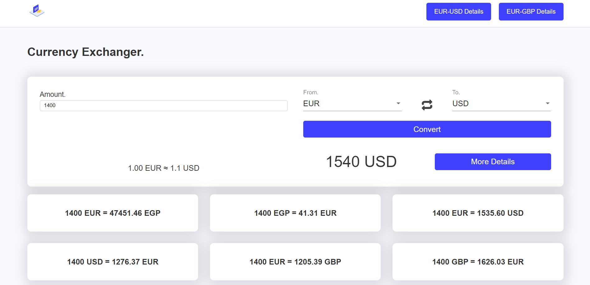
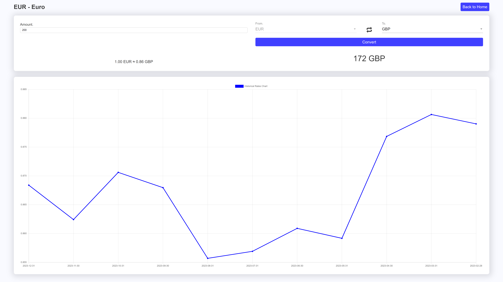

# [Currency Exchanger](https://currency-exchanger-snowy.vercel.app) 💹💰 

<h1 align="center">Home Page</h1>

<h1 align="center">Details Page</h1>

## Here's what I put into my consideration. 🧠

## 1. Git & CICD ⚡

* I used `Feature-Based` Git Workflow, not only Keep my development history intact and in multiple commits: `75` commit, I have made `4 PRs` each Pull Request has a specific feature from the sprint. 

* I used `Automatic CICD` offered by `Vercel`. 🌐

## 2. Structure (I used the following structure in my code). 🧹

- app
  - components
    - historical-rates
    - most-popular-currencies
  - core
    - constants
    - interceptors
    - models
    - services
    - utils
  - layout
    - header
  - pages
    - home
    - details
  - shared
    - components
      - button
      - chart
      - converter-panel
      - dropdowns

## 3. Style 🎨

* Utilizing my own SCSS.
* Mobile-First Approach.

## 4. TypeScript 

## 5. RxJs (Those are the Operators I used when needed.) ⚡🧠💪🏼

1. (`map` + `of`) For caching requests and return a stored data as *Observable*.
2. (`forkJoin`) For Joining 12-Month responses in one response.

## 6. Linting/Formatting 🫧

run `ng lint && ng format` for applying my linting/formating configuration in this project. [Config Files Attached].

